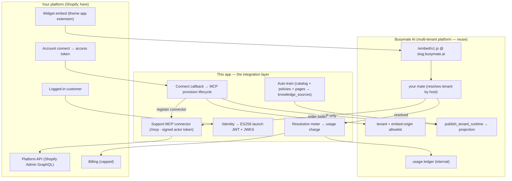

# Busymate AI for Shopify

**The official Busymate AI app for Shopify — and an open reference for connecting _any_
platform to Busymate AI.** Fork it, extend it, ship your own.

[](./LICENSE)
[](#stack)
[](./CONTRIBUTING.md)

Installing this app turns any Shopify store into **one [Busymate AI](https://busymate.ai)
white-label tenant** — an AI support assistant (**your mate**): answers only from the store's
own products, policies and content, with sources, and says when it is not sure ·
signed-in shoppers get order status, tracking and confirm-gated order actions ·
replies in the shopper's language (RTL included) · confidence-gated human handoff.

> **Two things at once.** This repository is **both** the real production app running at
> `shopify.busymate.ai` **and** a MIT-licensed, open reference implementation. If you run
> a SaaS, a marketplace, a CMS, or any platform with an "account", the same six-step
> pattern below connects it to Busymate AI — Shopify is just the worked example. Start
> with **[docs/EXTENDING.md](./docs/EXTENDING.md)** to adapt it to Stripe, WordPress,
> BigCommerce, or your own product.

---

## The Busymate AI integration pattern (works for any platform)

Busymate AI is a **universal, multi-tenant, white-label AI**. A platform integrates with
it entirely through **official contracts** — an MCP tool surface and a connector
protocol — and **never** through a backdoor database write. Any integration is these
six steps; everything platform-specific is isolated behind them:

| # | Step | What it does | The contract |
|---|------|--------------|--------------|
| **a** | **Provision a tenant** | Create one Busymate AI tenant per platform account, gated by **proof-of-origin** (no shared operator secret) | `provision_partner_tenant` (MCP) |
| **b** | **Brand + serve + publish** | Set the tenant's branding, allow the storefront origins to embed it, and publish the runtime projection so it goes live at `<slug>.busymate.ai` | `set_tenant_branding`, `add_tenant_embed_origin`, `publish_tenant_runtime` (MCP) |
| **c** | **Register a support connector** | Expose your platform's own tools (orders, refunds, returns…) so **your mate** can act, gated by tier + confirm + spend cap | `upsert_tenant_support_connector` (MCP) + your `/mcp` endpoint |
| **d** | **Embed the chat widget** | Drop the white-label widget onto your surface (`iframe`, `allow=microphone`) — no core template edit | `<script src=".../embed/v1.js" data-assistant="<slug>">` |
| **e** | **Identified launch** | Prove _who_ the visitor is (a signed ES256 JWT) so your mate scopes answers/actions to that account | `/.well-known/jwks.json` + a launch JWT registered as the tenant's visitor IdP |
| **f** | **Compliance seams** | Data export / erase / teardown on the platform's lifecycle + privacy events | `export_tenant_customer_data`, `redact_tenant_customer`, `suspend_tenant`, `delete_tenant` (MCP) |

The single hard invariant: **all-ops-via-MCP.** One module (`app/bmai.server.ts`) is the
only place that talks to Busymate AI. If an operation has no MCP tool, the fix is to add
the tool to the platform — not to reach around the contract.

### What's Shopify-specific vs. what's the pattern

Porting to another platform means **replacing only the left column**. The right column is
the reusable Busymate AI pattern and barely changes.

| Shopify-specific (swap it) | The Busymate AI pattern (keep it) |
|---|---|
| Managed OAuth install + offline token (`@shopify/shopify-app-react-router`) | Provision-on-account-connect lifecycle (`app/lib/provision.ts`) |
| Polaris + App Bridge embedded admin (`app/routes/app*.tsx`) | Your own settings UI calling the same MCP seam |
| Theme app extension injecting the widget (`extensions/`) | The embed `<script>` contract |
| App Proxy HMAC → logged-in customer (`app/lib/storefrontIdentity.ts`) | Identified-launch ES256 JWT + JWKS (`app/lib/identity.ts`) |
| Shopify Admin GraphQL tools (`app/mcp/tools/*`) | The `/mcp` connector transport + tiered/confirm gates (`app/mcp/*`) |
| Shopify Billing usage charges (`app/lib/usageBilling.ts`) | Your platform's billing (or none) |
| Shopify GDPR webhooks (`app/routes/webhooks.compliance.tsx`) | The compliance MCP effects (export/redact/teardown) |

Full porting guide: **[docs/EXTENDING.md](./docs/EXTENDING.md)**.

## Architecture



See **[docs/ARCHITECTURE.md](./docs/ARCHITECTURE.md)** ·
**[docs/PROVISIONING.md](./docs/PROVISIONING.md)** ·
**[docs/EXTENDING.md](./docs/EXTENDING.md)** ·
**[docs/LISTING.md](./docs/LISTING.md)**.
Canonical Busymate AI docs live at **[busymate.ai/docs](https://busymate.ai/docs)**.

## Stack

Shopify CLI 3 · **React Router 7** (`@shopify/shopify-app-react-router` — Remix merged
into RR7; the Remix package is maintenance-only) · Polaris + App Bridge · Prisma +
Postgres (the app's **own** DB — an independent failure domain, never the Busymate AI
control plane) · theme app extension · Shopify Billing API · `api_version 2026-07`.

## Quickstart (run it locally)

```bash
cp .env.example .env        # fill in the values documented in each comment
npm install
npx prisma migrate dev      # sets up the app's own local Postgres/SQLite schema
npm run dev                 # shopify app dev (needs a Shopify Partner login)
npm test                    # vitest — provisioning seam, tool gating, connector contract
npm run typecheck && npm run lint && npm run build
```

`npm test`, `npm run typecheck`, and `npm run build` run **credential-free** — they
exercise every code path without a Partner app or a Busymate AI credential. `npm run dev`
needs a Shopify Partner app; see below.

## Quickstart for your own fork

1. **Create your Shopify Partner app** (Partners → Apps → Create app), then
   `npm run config:link` — the CLI writes your `client_id` into `shopify.app.toml`. Set
   your own `name` / `handle` / `application_url` / `redirect_urls` there too.
2. **Get a Busymate AI partner credential** so your app can provision tenants — see
   [SETUP.md §4](./SETUP.md). (Adapting to a non-Shopify platform? [docs/EXTENDING.md](./docs/EXTENDING.md).)
3. **Fill `.env`** from `.env.example` — every variable documents where it comes from.
4. **Host it** — `npm run build && npm start` behind TLS (reference `systemd` unit +
   `nginx` vhost in [`deploy/`](./deploy)), with the app's own Postgres.

Nothing in this repo is a secret: `.env` is gitignored, and `.env.example` +
`shopify.app.toml` ship placeholders only.

## Contributing

Contributions are welcome — bug fixes, new platform tools, docs, and especially **new
platform ports** built on the pattern above. Please read:

- **[CONTRIBUTING.md](./CONTRIBUTING.md)** — setup, tests, and the PR flow.
- **[CODE_OF_CONDUCT.md](./CODE_OF_CONDUCT.md)** — be kind.
- **[SECURITY.md](./SECURITY.md)** — how to report a vulnerability (please don't open a
  public issue for security).

Every change ships a test (`test/**`, `npm test`), and merchant-facing copy must say
**"Busymate AI"** / **"your mate"**, never the retired codenames "bro"/"eve"/"bmai" —
enforced by `test/naming.test.ts`.

## Status & production notes

This is a **real, working application**, not a toy. It is also **not a turnkey deploy**:
going live requires resources only an owner can create — a Shopify Partner app, a
Busymate AI provisioning credential, an app host + DNS + TLS, an ES256 launch key, a
billing plan, and the App Store listing assets. The exact steps are in
**[SETUP.md](./SETUP.md)**; Built-for-Shopify compliance status is in
**[CHECKLIST.md](./CHECKLIST.md)**.

## License

[MIT](./LICENSE) — fork it, adapt it, ship your own.
