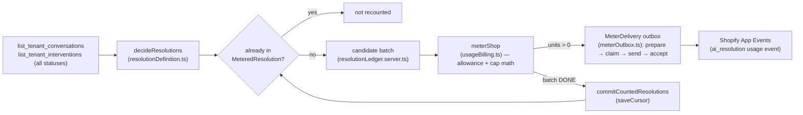

# Billing — AI-resolution metering (#19)

App issue #19 closed the LAST gap the 2026-09-11 review found:
`usageBilling.ts` used to read `get_tenant_usage` as if it returned a
`{ resolutions, cursor }` pair; that tool actually returns tenant entity counts,
so usage was permanently unreadable and every batch held forever. This doc
records the fix as the single source of truth for the billing definition and
pipeline — read it before changing anything under `app/lib/{resolution,meter,
usage}*`.

## The definition (boss default, 2026-09-13)

> **A billable AI resolution is a visitor conversation the assistant answered
> that ended WITHOUT a human hand-off, and was NOT reopened by the same
> visitor within 24 hours.**

Implemented, pure and unit-tested, in `app/lib/resolutionDefinition.ts`
(`decideResolutions` / `RESOLUTION_DEFINITION`). It is also shown verbatim on
the merchant's Billing page (`app/routes/app.billing.tsx`) next to the
current-cycle count.

Three inputs decide each conversation, from a single MCP snapshot (no diffing
across runs needed — see "why one snapshot suffices" below):

| Signal | Source | Disqualifies when |
|---|---|---|
| Still live | `list_tenant_conversations` (`live`) | `live === true` — not ended yet |
| Human hand-off | `list_tenant_interventions`, ANY status (`listTenantInterventionsAll`) | any intervention row references the session — open, resolved, or declined all count; the Conversations-page inbox (`listTenantHandoffs`) only shows OPEN ones, a different, narrower read |
| Reopened within 24h | `list_tenant_conversations` (`lastActiveAt`) | `now − lastActiveAt < 24h` |

**Why one snapshot suffices for "not reopened within 24h":** `lastActiveAt`
only ever advances when another turn is added to that session. So "no activity
in the last 24h" (one read, one timestamp compare) and "not reopened within
24h of ending" (would need to diff two reads) are the same fact. A
conversation still inside the 24h window is not yet decidable and is simply
re-checked on the next scan — never guessed either way (fail-closed).

## The pipeline

1. **Producer** (`app/lib/resolutionLedger.server.ts`, `readNewResolutions`):
   reads conversations + hand-offs via MCP, applies the definition, and drops
   any session already in the `MeteredResolution` ledger. Returns a *candidate*
   batch — it does **not** write yet.
2. **Idempotent commit boundary** (`MeteredResolution`, `@@unique([tenantId,
   sessionId])`): a session is permanently counted **at most once, ever**,
   however many times the rolling `list_tenant_conversations` window re-surfaces
   it. Committed only once a batch is DONE — see "retry safety" below.
3. **Allowance / cap math** (`usageBilling.meterShop`, unchanged by this
   change — still the tested pure function): counts resolutions against the
   plan's included allowance per cycle, computes billable overage units,
   clamps to the plan's monthly spend cap. The widget is never disabled.
4. **Durable delivery** (`app/lib/meterOutbox.ts`, `MeterDelivery` table): a
   billable batch is `prepare`d (immutable, per-shop-locked, one pending batch
   at a time — protects against overlapping timer + page-load metering),
   `claim`ed (30s DB-clock lease — protects against two concurrent workers),
   sent to **Shopify App Events** (`ai_resolution` usage event — this app bills
   under declarative **App Pricing**, which meters via App Events, not the
   legacy `AppUsageRecord`/`appUsageRecordCreate` API), then `accept`ed.
5. **Retries**: a batch held by a transient failure (App Events down, no
   active billing cycle, a concurrent claim) is never committed to the ledger,
   so it is safely re-derived next run — usually with the **identical**
   evidence hash as its cursor/idempotency key (`evidenceRefFor`, a content
   hash of the session-id set, not a wall-clock value), so a retry reuses the
   same Shopify idempotency key.
6. **Dead-letter, visible**: if the shop's billing/tenant/plan snapshot
   changed between `claim` and `accept` (e.g. the merchant changed plans
   mid-delivery), the delivery moves to `state = 'reconciliation'` — it blocks
   further batches for that shop until a human resolves it, and is surfaced as
   a critical banner on the Billing page (`listStuckDeliveries`). It is never
   auto-retried silently.

## Known limitation — `subscriptionId`

`PreparedMeterBatch.subscriptionId` exists to detect "the merchant's contract
changed under us" between `prepare` and `accept`. Declarative **App Pricing**
has no legacy `AppSubscriptionLineItem` id (`legacySubscriptionId` is null), so
this app substitutes the current billing cycle's `startTime` as the stability
identity — a plan/contract change normally rolls the cycle too, but a same-cycle
mid-period downgrade is not independently detected by this field alone (the
plan-handle mismatch inside `matches()` still catches the common case). Explicit
handling of a same-cycle plan change is a follow-up if it proves to matter in
practice.

## Zero usage and a deprovisioned tenant (0.1.11)

Verifying live on the review store surfaced two more bugs, both fixed in 0.1.11:

- **A zero-usage store must render "0 resolutions this cycle", never
  "unavailable".** `app/lib/usageDisplay.ts`'s `measuredCycleResolutions` used
  to require a truthy `cycleKey` in the stored cursor as a proxy for "this was
  really measured" — but `meterShop`'s zero-resolution and Free-plan branches
  never populate `cycleKey` (it is meterShop's own per-cycle-reset bookkeeping,
  not a display-trust signal). A `v:1` payload whose `cycleResolutions` is
  already a validated safe non-negative integer IS the proof; the extra gate
  was dropped.
- **A deprovisioned/archived tenant is a quiet zero, not "unreadable".**
  `list_tenant_conversations` / `list_tenant_interventions` refuse with
  `tenant_management_denied` when this app's stored provisioner identity is no
  longer admin-of a tenant (the platform-side tenant was archived/deleted while
  the local `ShopTenant.bmaiTenantId` kept pointing at it). That is a known,
  stable condition — `resolutionLedger.server.ts` now treats it as a real
  zero (never held/"unreadable") and records it on `ShopTenant.tenantUnreachableAt`
  (migration `20260913130000_tenant_unreachable_flag`), logging ONCE on the
  first denial and once on recovery — never once per hourly run. Any OTHER
  refusal reason still fails closed exactly as before (held, retried, never
  guessed as zero).

## Env / ops

No new env vars. Reuses `SHOPIFY_APP_EVENTS_CLIENT_ID`/`_SECRET` (App Events),
`PARTNER_ORG_ID` + `PARTNER_API_*` (billing cycle), and the existing
`BILLING_METER_SECRET`-gated `POST /api/billing/meter` hourly timer (SETUP.md
§11). Migration: `prisma/migrations/20260913090000_metered_resolution_ledger`
(additive — `npx prisma migrate deploy`, same host runbook as SETUP.md §3b).

## Incident 2026-09-13 — shared refresh credential revoked by a concurrent refresh

**What happened.** During live verification of 0.1.9 a one-off script issued the
two producer reads (`list_tenant_conversations` + `list_tenant_interventions`) via
`Promise.all` through the app's shared `mgmt` credential on a cold token cache.
`createTokenProvider.getAccessToken()` had no request coalescing, so both calls
POSTed the SAME rotating refresh token to `/token` at once; the edge treated the
second as replay outside its 60 s grace window and **revoked the whole token
family** (`400 invalid_grant`). The credential is shared by every bmai operation
of every shop, so the live app kept working only on its cached 1 h access token
and started failing app-wide (`BmaiCredentialError`) once that expired.
`readNewResolutions` used the identical `Promise.all` pattern, so the hourly
meter run would have re-triggered it on the first cold cache after any restart.

**Recovery (done 2026-09-13 ~10:34 EEST).** Re-minted the credential value-blind
with `scripts/mint-provision-credential.mjs` against the EXISTING provisioner
identity, installed `BMAI_MGMT_*` on the host env via stdin, dropped the stale
`BmaiCredential` `mgmt` row (the store wins over the seed, so a stale row would
have kept the revoked family), proved with ONE sequential read per tool, then
restarted the service.

**Fix (0.1.10).**
- `app/lib/bmaiToken.ts`: **single-flight refresh** — every concurrent caller on a
  cold/expired cache awaits ONE shared in-flight promise; the grant is posted
  exactly once. `invalidate(staleToken)` is token-aware, so a late 401 on an old
  token never drops a fresher token another caller just minted.
- `app/bmai.server.ts`: the retry-once-on-401 passes the rejected token to
  `invalidate` and waits for the coalesced refresh.
- `app/lib/resolutionLedger.server.ts`: the two reads are **sequential** (belt and
  suspenders on top of the coalescing) and handoffs are skipped when
  conversations are unreadable.
- Tests: `test/bmaiToken.test.ts` (8 concurrent callers → 1 grant; failed
  in-flight refresh rejects all + clears the slot; token-aware invalidate) and
  `test/resolutionLedger.test.ts` (ordering + skip).

**Rule.** Never run two MCP calls concurrently through a freshly-started process
from an ad-hoc script that shares the app's credential; one process = one
refresh chain. Any host-side verification script uses ONE call at a time and is
followed by a service restart (so the running app loads the rotated token from
the store).

## Tests

- `test/resolutionDefinition.test.ts` — the definition itself (pure).
- `test/resolutionLedger.test.ts` — the producer: MCP → definition → idempotent
  candidate batch, retry-stable cursor, fail-closed on an unreadable MCP read.
- `test/meterOutbox.test.ts` — the delivery core (cherry-picked from the prior
  draft, PR #28 — see below), unchanged.
- `test/usageBilling.test.ts` — the allowance/cap pure logic, unchanged
  (`meterShop`'s tested behavior was not touched; only `liveMeterDeps()`, the
  production wiring, changed).

## Superseded: draft PR #28

PR #28 ("Prepared billing outbox foundation (unwired)") staged the
`MeterDelivery` outbox core as an intentionally-unwired draft, blocked on "no
qualifying AI-resolution producer" (#19). This change supplies that producer
and wires the outbox into `meterShop` for real. PR #28's outbox commits were
cherry-picked verbatim (`app/lib/meterOutbox.ts` is byte-identical to the
draft); its branch is superseded by this one and closed with a pointer here.
